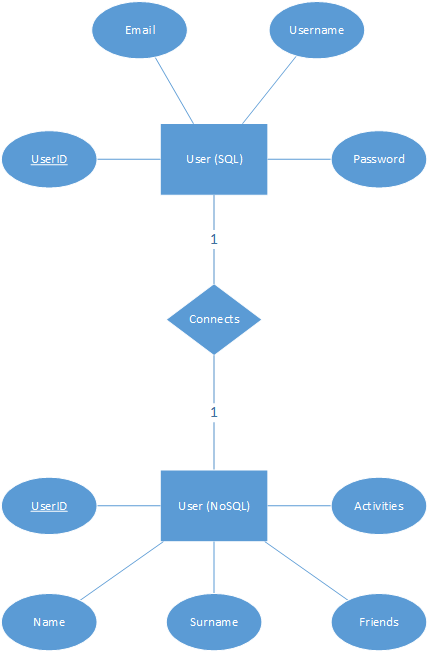

# Project Management App

This is a full stack app that keeps track of a user activities and projects.

## Front end

Front end must have:

* Login/Sign up page for the users. It should redirect here if no user is logged in.
* A page that dynamically adds or removes activities the user does. It should redirect here if a user is logged in.
* A support page that the user could change password.
* The correct HTTP requests to get the data from the REST server.
* Presentable user interface and a good user experience.

It would be nice to have:

* A dark/light mode switch
* Public/private activities
* A page that shows other users' activities
* A friend system, with a chat

Front end can be implemented in either Angular, Vue or React.

## Back end

Back end must have:

* A Restful API that serves the client.
* An SQL database that has the user's credentials.
* A non-SQL database that keeps the activities of the user.
* Containerized docker environment.

It would be nice to have:

* An email system.
* Deployed on a server in the Cloud. It could be deployed either with Docker Swarm, Nomad or Kubernetes.

Back end can be implemented in either Python, NodeJS, Golang, PHP or dotnet environment.

## Database Design



The NoSQL Users must look like:

```json
{
  [
    {
      _id: '132',
      name: 'foo',
      surname: 'bar',
      friends: [
        _id: '345',
        _id: '678'
      ]
      activities: [
        {
          activity_name: 'code lol',
          hidden: false
        },
        {
          activity_name: 'go to buy PS5 on media markt',
          hidden: true
        }
      }
    }
  ]
}
```

The equivalent SQL user looks like:

```text
|  id  |    email     |  username |   password  |
| 123  |  foo@bar.com |   foobar  |   @dga;b3rf |
```

The password must be a secret.

## Idea by 💡

<!-- prettier-ignore-start -->
<!-- markdownlint-disable -->
<table>
    <tr>
        <td align="center">
             <br>
            <b>Andrei Rusu</b><br>
            <a href="https://github.com/UsurAndrei">Github/UsurAndrei</a><br>
            Main idea
        </td>
          <td align="center">
             <br>
            <b>Iakovos Mastrogiannopoulos</b><br>
            <a href="https://github.com/IakMastro">Github/IakMastro</a><br>
            Documentation/planner
        </td>
    </tr>
</table>
<!-- markdownlint-enable -->
<!-- prettier-ignore-end -->
